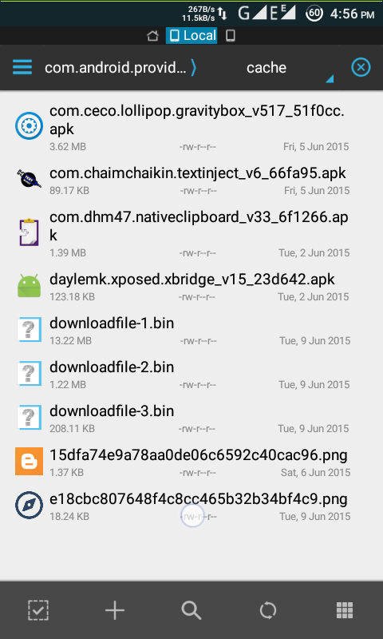
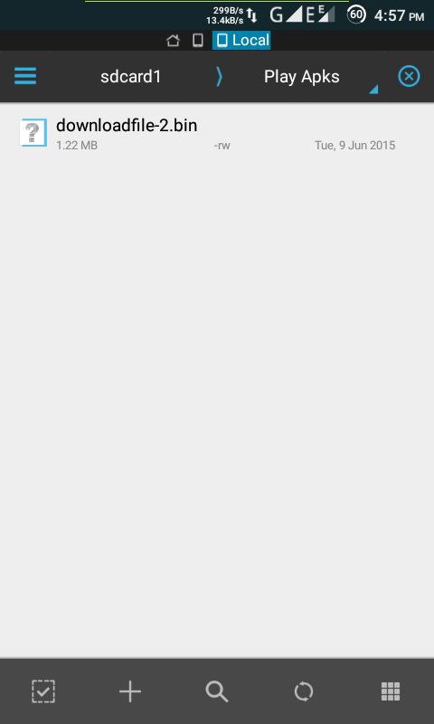
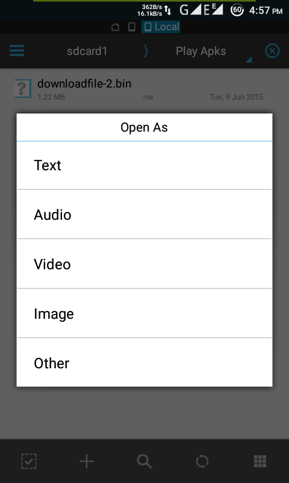
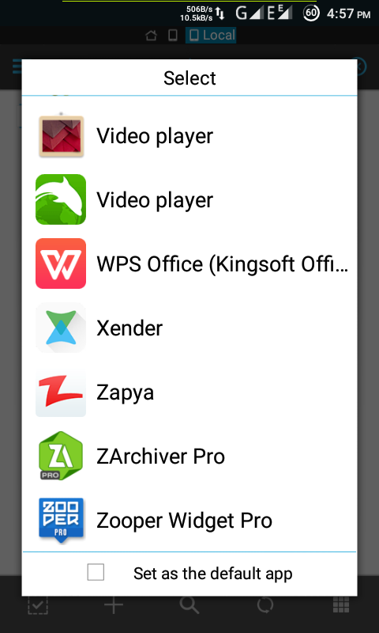
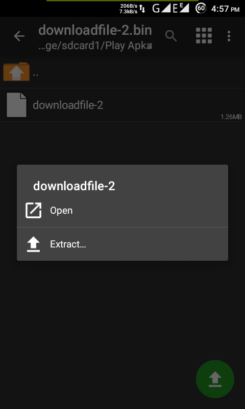
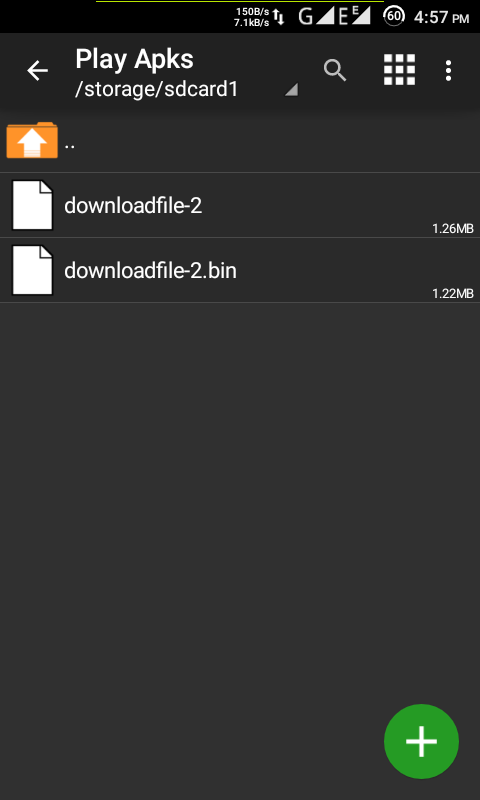
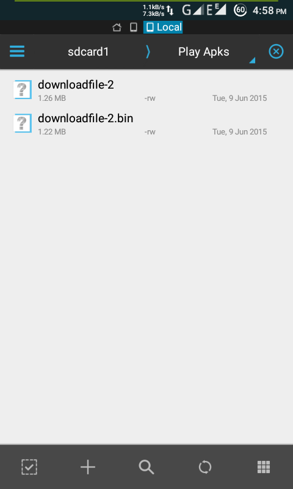
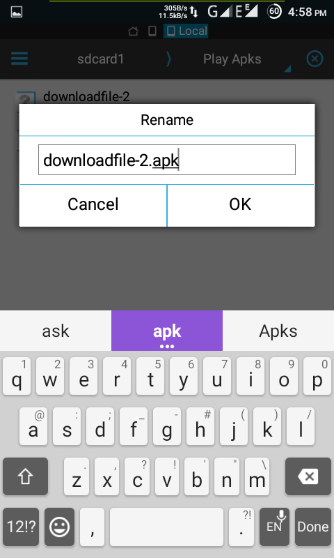
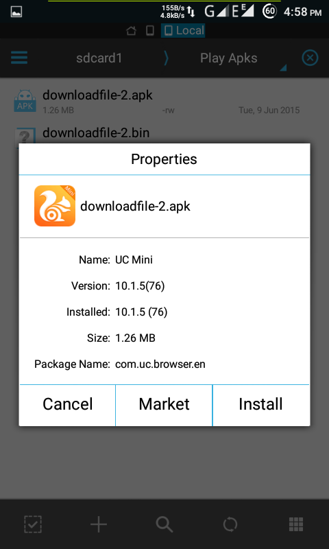

Many People wants to know that Whare the downloaded apps from Play Store are stored.

So I found a Ans of this.

If you want to know then follow these simple steps.

First Things First :

What you need : 1. ROOT \[Obviously \]. 2. Any Explorer with root permissions. ES Files Explorer Is fine. This Guide is based on ES File Explorer. 3. Any Extractor. ZArchiver is Fine. This guide is based on ZArchiver.

Procedure: 1. Go to

`/data/data/com.android.providers.downloads/cache/` 

2\. There you will see files starting with **downloadfile-x.bin**. Copy **downloadfile-x.bin** to any location. I have copied **downloadfile-2.bin** to sdcard1/Play Apks 

3\. Then tap on copied downloadfile-2.bin and tap on other in open as dialog. 

4\. Then tap on ZArchiver. This will open ZArchiver. 

5\. You will see downloadfile-x in the archive. In this case there is downloadfile-2. 

6\. Tap on downloadfile-x and select extract. 

7\. Select extraction path and extract the file. I have extracted this file to same location. 

8\. Now go to ES File Explorer. 

9\. Then Select the extracted file and tap rename. Rename it to anything with extension **apk**. I have renamed **downloadfile-2** to **downloadfile-2.apk** 

10\. TADA!! This is your apk file. 

Now You Can join AfterROOT. go to [Join AfterROOT](http://goo.gl/rYKFQL)

#AfterROOT
