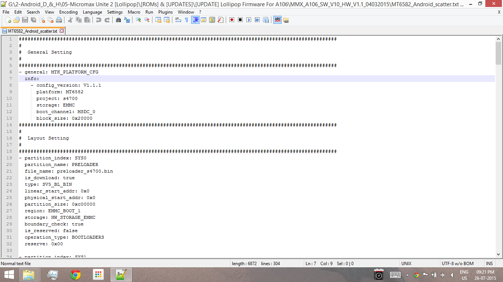
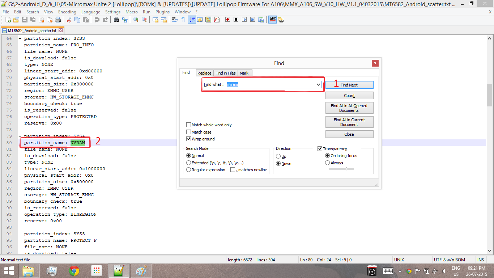
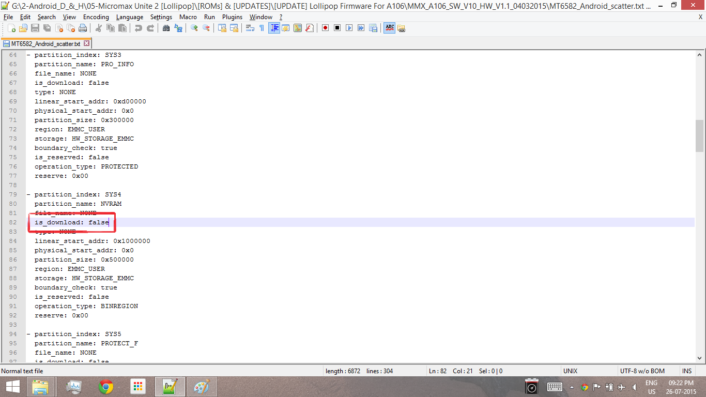
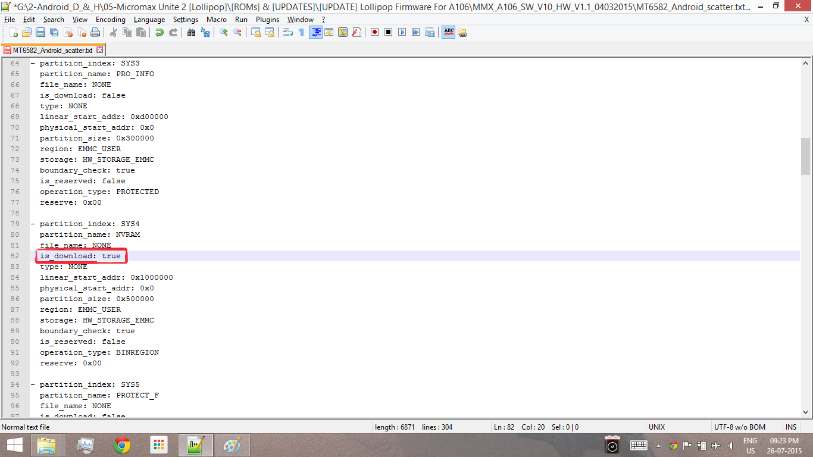
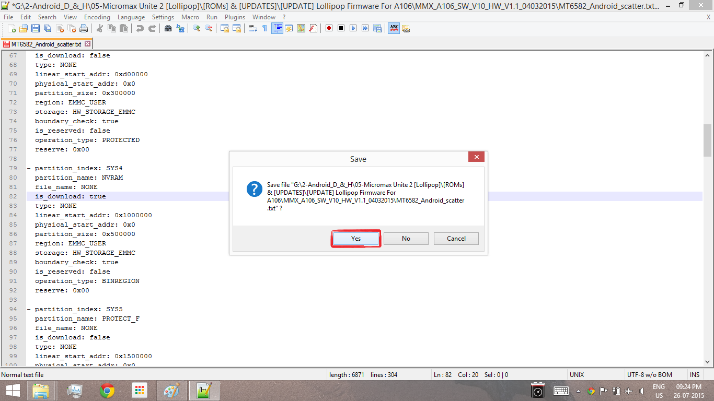
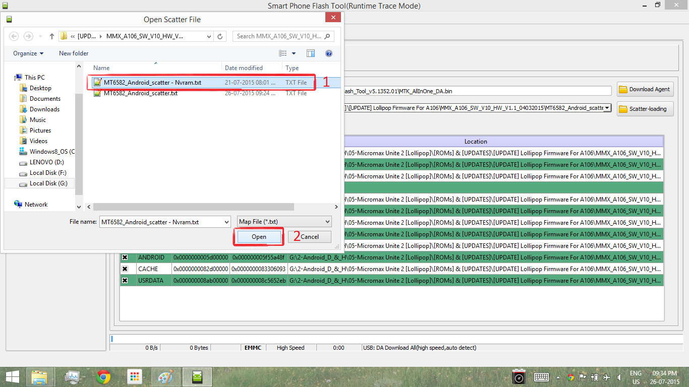
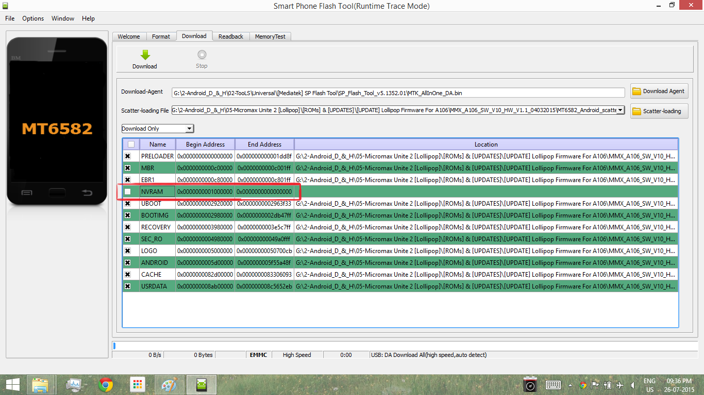
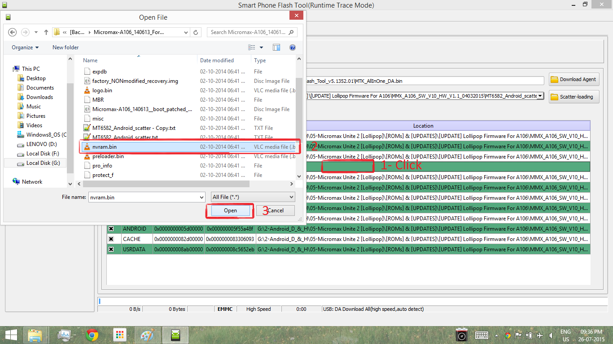
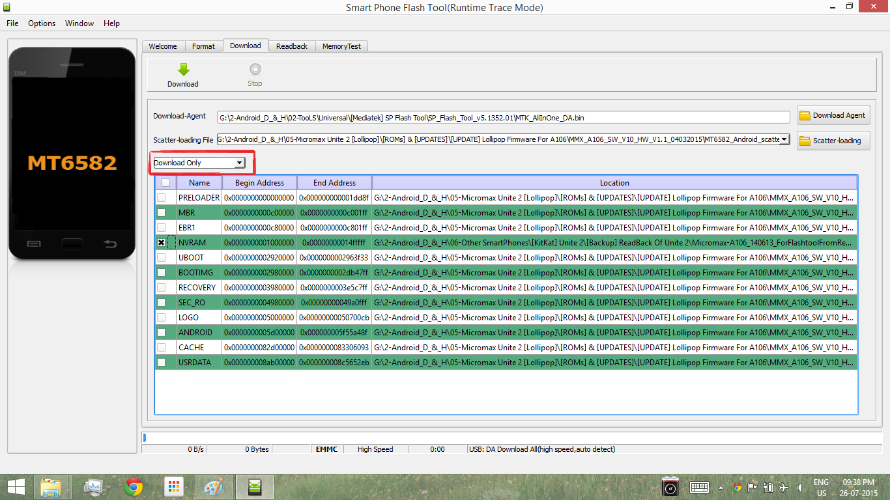
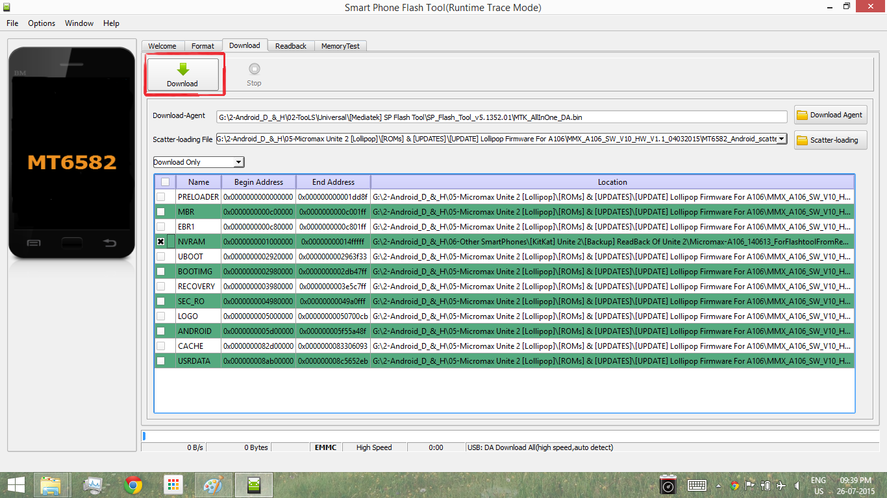

#### Try this method at your own risk. I am not responsible for any damage to your phone

What You Need: 1. NVRAM.bin of Your MediaTek SmartPhone 📱. If you don't have nvram.bin backup then [download this.](https://goo.gl/LHqo2O)

\[This navram.bin is backed up from MMX Unite 2. Don't know this works on your phone or not. So flash at your own risk.\] 2. SP Flash Tool. 3. Scatter.txt of Your 📱. 4. Some Knowledge About Flashing.

Note: This Guide is based on Unite 2.

Procedure: 1. Open Scatter file in any text editor. I prefer Notepad++.

\[caption width="1366" align="alignnone"\]\[/caption\]

1. Now find nvram in it.

\[caption width="1366" align="alignnone"\]\[/caption\]

1. Now Look for is\_download: false.

\[caption width="1366" align="alignnone"\]\[/caption\]

1. Now replace false to true.

\[caption width="1366" align="alignnone"\]">\[/caption\]

1. Save the scatter file.

\[caption width="1366" align="alignnone"\]">\[/caption\]

1. Load scatter in SP Flash Tool.

\[caption width="1366" align="alignnone"\]">\[/caption\]

1. There will be nvram option. Deselect all files and select only nvram.

\[caption width="1366" align="alignnone"\]">\[/caption\]

1. Now open NVRAM.bin in sp flash tool. Make sure download only is selected.

\[caption width="1366" align="alignnone"\]\[/caption\]

\[caption width="1366" align="alignnone"\]\[/caption\]

1. Now select download button.

\[caption width="1366" align="alignnone"\]">\[/caption\]

1. Now connect your phone w/o battery 🔋.
2. Wait till download completes.
3. Disconnect your phone 📱.
4. Congratulations 🎊!! NVRAM restored & IMEI permanently fixed.
